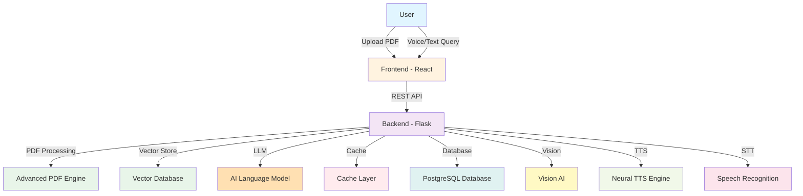

<div align="center">

# 🎓 dokguru Voice

### *Intelligent Document Analysis with Multilingual Voice Interface*

[](https://www.python.org/downloads/)
[](https://reactjs.org/)
[](https://flask.palletsprojects.com/)
[](LICENSE)

**Transform PDFs into interactive conversations. Ask questions, get answers in your language.**

[Features](#-features) • [Quick Start](#-quick-start) • [Architecture](#%EF%B8%8F-architecture) • [API](#-api-reference) • [Deployment](#-deployment)


</div>

---

## 📖 Overview

**dokguru Voice** is an enterprise-grade AI-powered document analysis platform that combines advanced RAG (Retrieval-Augmented Generation) technology with multilingual voice capabilities. Upload PDFs, ask questions in natural language, and receive intelligent responses with voice output in multiple languages.

### 🎯 Why dokguru Voice?

- **🚀 Production Ready** - Enterprise features with secure authentication and rate limiting
- **🌍 Multilingual** - Support for English, Hindi, and Kannada with auto-detection
- **⚡ High Performance** - Optimized architecture with intelligent caching
- **🎙️ Complete Voice Pipeline** - End-to-end voice interface (STT → RAG → TTS)
- **📊 Multimodal** - Extract insights from text, tables, and images
- **🔒 Secure & Scalable** - Built for business applications

---

## ✨ Features

<table>
<tr>
<td width="50%">

### 🤖 Intelligent Document Understanding
- **Advanced PDF Processing** - Extract text, tables, and images
- **Semantic Search** - ChromaDB vector store with sentence-transformers
- **Context-Aware** - Maintains conversation history
- **Multi-Document** - Query across multiple PDFs
- **Source Citations** - Automatic page references

</td>
<td width="50%">

### 🗣️ Multilingual Voice
- **3 Languages** - English, Hindi, Kannada
- **Auto-Detection** - Automatically detect language from text
- **Advanced Neural TTS** - High-quality neural voice synthesis
- **Speech-to-Text** - AI-powered speech recognition
- **Adjustable Speed** - Configure speech rate

</td>
</tr>
<tr>
<td width="50%">

### 🔒 Enterprise Security
- **JWT Authentication** - Secure token-based auth
- **Role-Based Access** - Student/Professional/Researcher roles
- **Rate Limiting** - Redis-powered request throttling
- **Usage Quotas** - Configurable limits per user
- **Password Security** - Bcrypt hashing

</td>
<td width="50%">

### 📊 Advanced Analysis
- **Table Extraction** - Camelot + Tabula integration
- **Image Understanding** - Gemini Vision for diagrams
- **Smart Retrieval** - Query-type detection
- **Confidence Scoring** - Response reliability metrics
- **Analytics** - PostHog + Sentry integration

</td>
</tr>
</table>

---

## 🏗️ Architecture

### System Overview



### Technology Stack

<table>
<tr>
<th width="25%">Category</th>
<th width="75%">Technologies</th>
</tr>
<tr>
<td><strong>Frontend</strong></td>
<td>
React 18 • Vite • Tailwind CSS • Framer Motion • Zustand • Axios
</td>
</tr>
<tr>
<td><strong>Backend</strong></td>
<td>
Flask 3.0 • Python 3.11+ • Gunicorn • JWT • Bcrypt
</td>
</tr>
<tr>
<td><strong>AI/ML</strong></td>
<td>
Advanced LLM • Semantic Embeddings • Vector Database • Vision AI
</td>
</tr>
<tr>
<td><strong>Voice</strong></td>
<td>
Neural TTS Engine • Speech Recognition • Language Detection
</td>
</tr>
<tr>
<td><strong>Data</strong></td>
<td>
PostgreSQL • Redis Cache • Vector Store
</td>
</tr>
<tr>
<td><strong>Monitoring</strong></td>
<td>
Error Tracking • Analytics • Email Service
</td>
</tr>
</table>

---

## 🚀 Quick Start

**Prerequisites:** Python 3.11+, Node.js 18+

1. Clone repository and install dependencies
2. Configure API keys in `.env` files (backend + frontend)
3. Run backend: `cd backend && python app.py` (port 8080)
4. Run frontend: `cd frontend && npm run dev` (port 5173)

See [DEPLOYMENT_GUIDE.md](DEPLOYMENT_GUIDE.md) for detailed setup instructions.

---

## ⚙️ Environment Configuration

### Required Configuration

The application requires several API keys and configuration settings. Contact the administrator for access credentials.

### Backend `.env`

```env
# ===== REQUIRED =====
LLM_API_KEY=your_api_key_here
VISION_API_KEY=your_api_key_here
DATABASE_URL=your_database_url
DATABASE_KEY=your_database_key
SECRET_KEY=your_secret_key_minimum_32_chars

# ===== OPTIONAL (Performance) =====
CACHE_URL=your_cache_url
CACHE_TOKEN=your_cache_token

# ===== OPTIONAL (Monitoring) =====
ERROR_TRACKING_DSN=your_dsn_here
ANALYTICS_KEY=your_key_here
EMAIL_API_KEY=your_key_here

# ===== CONFIGURATION =====
TTS_SPEED_MULTIPLIER=1.75
CORS_ORIGINS=http://localhost:5173,http://localhost:3000
```

### Frontend `.env`

```env
VITE_API_BASE_URL=http://localhost:8080
```

---

## 📚 API Reference

### Authentication

```bash
# Sign Up
POST /auth/signup
{
  "email": "user@example.com",
  "password": "password123",
  "role": "student",
  "institution": "MIT"
}

# Login
POST /auth/login
{
  "email": "user@example.com",
  "password": "password123"
}
# Returns: { "token": "jwt_token", "user": {...} }
```

### Document Management

```bash
# Upload PDF
POST /upload
Headers: Authorization: Bearer <token>
Content-Type: multipart/form-data
Body: file=document.pdf

# List Documents
GET /documents
Headers: Authorization: Bearer <token>

# Delete Document
DELETE /documents/:name
Headers: Authorization: Bearer <token>
```

### Query & Voice

```bash
# Ask Question (with voice support)
POST /ask
Headers: Authorization: Bearer <token>
{
  "question": "What is photosynthesis?",
  "language": "hi"  # Optional: 'auto', 'en', 'hi', 'kn', etc.
}

# Text-to-Speech
POST /speak
Headers: Authorization: Bearer <token>
{
  "text": "Hello world",
  "language": "auto"
}

# Get Supported Languages
GET /tts/languages
# Returns: { "languages": { "en": "English", "hi": "Hindi", "kn": "Kannada" } }
```

---

## 🎨 Supported Languages

### Available Languages
🌐 **Auto-detect** • 🇬🇧 **English** • 🇮🇳 **Hindi** • 🇮🇳 **Kannada**

Our AI-powered system automatically detects the language and provides high-quality neural voice synthesis in all supported languages.

---

## 📊 Performance

### Optimizations

Our platform delivers exceptional performance through:
- ⚡ Intelligent caching layer
- ⚡ Optimized document processing
- ⚡ Parallel processing architecture
- ⚡ Efficient database operations
- ⚡ Smart resource management

---

## 🚢 Deployment

### Production Deployment

Deployment requires proper configuration of environment variables and API credentials.

**Requirements:**
- Python 3.11+ environment
- Node.js 18+ for frontend build
- Configured environment variables
- Database and cache services

Contact the project administrator for deployment guidelines and credentials.

---

## 🔐 Security Features

- ✅ **JWT Authentication** - Secure token-based system
- ✅ **Password Hashing** - Bcrypt with 12 rounds
- ✅ **CORS Protection** - Configurable origin whitelist
- ✅ **Rate Limiting** - Redis-based throttling
- ✅ **Input Validation** - Comprehensive sanitization
- ✅ **SQL Injection Prevention** - ORM-based queries
- ✅ **XSS Protection** - React auto-escaping
- ✅ **File Upload Security** - Type and size validation

---

## 📈 Usage Limits (Beta)

| Resource | Free Tier | Configurable |
|----------|-----------|--------------|
| Documents per user | 5 | ✅ Via database |
| Queries per day | 50 | ✅ Via database |
| Max file size | 10 MB | ✅ Via code |
| API rate limit | 100/hour | ✅ Via Redis |

---

## 🧪 Testing

Contact the development team for testing procedures and documentation.

---

## 📖 Documentation

Additional documentation is available to authorized personnel. Contact the project administrator for access.

---

## 🗺️ Roadmap

- [x] ✅ Advanced RAG System
- [x] ✅ Multilingual Voice Support (3 languages)
- [x] ✅ Secure Authentication
- [x] ✅ Usage Management
- [x] ✅ Performance Optimizations
- [ ] 🔄 Additional Features (Coming Soon)

---

## 🤝 Contributing

This is a proprietary business project. For collaboration opportunities, please contact the project owner.

---

## 📄 License

This project is licensed under the MIT License - see the [LICENSE](LICENSE) file for details.

---

## 🙏 Acknowledgments

**Built with:**
Flask • React • Tailwind CSS • Framer Motion • Advanced AI Models • Neural Voice Technology

---

<div align="center">

### Built with ❤️ for students, researchers, and knowledge seekers worldwide

[](https://github.com/choudharikiranv15)
[](https://www.linkedin.com/in/kiranchoudhari-1510m)
[](mailto:choudharikiranv15@gmail.com)

**Status:** ✅ Production Ready | **Version:** 1.0.0-beta | **Last Updated:** January 2025

</div>
