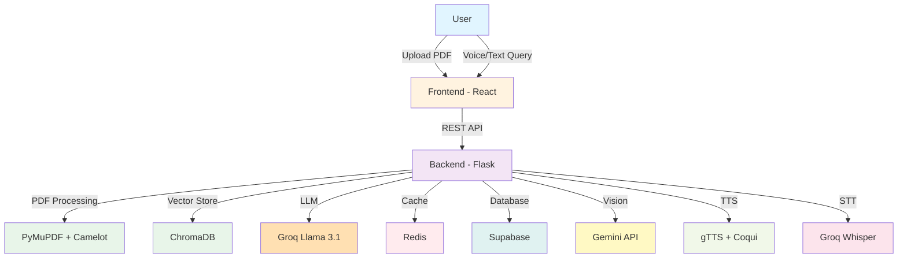

<div align="center">

# 🎓 DocuMind Voice

### *Intelligent Document Analysis with Multilingual Voice Interface*

[](https://www.python.org/downloads/)
[](https://reactjs.org/)
[](https://flask.palletsprojects.com/)
[](LICENSE)

**Transform PDFs into interactive conversations. Ask questions, get answers in your language.**

[Features](#-features) • [Quick Start](#-quick-start) • [Architecture](#%EF%B8%8F-architecture) • [API](#-api-reference) • [Deployment](#-deployment)


</div>

---

## 📖 Overview

**DocuMind Voice** is an enterprise-grade AI-powered document analysis platform that combines advanced RAG (Retrieval-Augmented Generation) technology with multilingual voice capabilities. Upload PDFs, ask questions in natural language, and receive intelligent responses with voice output in 100+ languages.

### 🎯 Why DocuMind Voice?

- **🚀 Production Ready** - Enterprise features with JWT auth, rate limiting, and analytics
- **🌍 Truly Multilingual** - 100+ languages with auto-detection
- **⚡ High Performance** - Optimized for speed with Redis caching and vector embeddings
- **🎙️ Complete Voice Pipeline** - End-to-end voice interface (STT → RAG → TTS)
- **📊 Multimodal** - Extract insights from text, tables, and images
- **💰 Zero Cost** - Deploy free on Render with all features

---

## ✨ Features

<table>
<tr>
<td width="50%">

### 🤖 Intelligent Document Understanding
- **Advanced PDF Processing** - Extract text, tables, and images
- **Semantic Search** - ChromaDB vector store with sentence-transformers
- **Context-Aware** - Maintains conversation history
- **Multi-Document** - Query across multiple PDFs
- **Source Citations** - Automatic page references

</td>
<td width="50%">

### 🗣️ Multilingual Voice
- **100+ Languages** - Hindi, Kannada, Tamil, Telugu, etc.
- **Auto-Detection** - Automatically detect language from text
- **Dual TTS Engines** - gTTS (multilingual) + Coqui (high-quality English)
- **Speech-to-Text** - Groq Whisper with fallbacks
- **Adjustable Speed** - Configure speech rate

</td>
</tr>
<tr>
<td width="50%">

### 🔒 Enterprise Security
- **JWT Authentication** - Secure token-based auth
- **Role-Based Access** - Student/Professional/Researcher roles
- **Rate Limiting** - Redis-powered request throttling
- **Usage Quotas** - Configurable limits per user
- **Password Security** - Bcrypt hashing

</td>
<td width="50%">

### 📊 Advanced Analysis
- **Table Extraction** - Camelot + Tabula integration
- **Image Understanding** - Gemini Vision for diagrams
- **Smart Retrieval** - Query-type detection
- **Confidence Scoring** - Response reliability metrics
- **Analytics** - PostHog + Sentry integration

</td>
</tr>
</table>

---

## 🏗️ Architecture

### System Overview



### Technology Stack

<table>
<tr>
<th width="25%">Category</th>
<th width="75%">Technologies</th>
</tr>
<tr>
<td><strong>Frontend</strong></td>
<td>
React 18 • Vite • Tailwind CSS • Framer Motion • Zustand • Axios
</td>
</tr>
<tr>
<td><strong>Backend</strong></td>
<td>
Flask 3.0 • Python 3.11+ • Gunicorn • JWT • Bcrypt
</td>
</tr>
<tr>
<td><strong>AI/ML</strong></td>
<td>
Groq (LLM) • Sentence-Transformers • ChromaDB • Gemini Vision
</td>
</tr>
<tr>
<td><strong>Voice</strong></td>
<td>
Groq Whisper (STT) • gTTS (TTS) • Coqui TTS • Language Detection
</td>
</tr>
<tr>
<td><strong>Data</strong></td>
<td>
Supabase (PostgreSQL) • Redis (Upstash) • ChromaDB
</td>
</tr>
<tr>
<td><strong>Monitoring</strong></td>
<td>
Sentry (Errors) • PostHog (Analytics) • Resend (Email)
</td>
</tr>
</table>

---

## 🚀 Quick Start

### Prerequisites

```bash
Python 3.11+    # Backend runtime
Node.js 18+     # Frontend build tool
Redis           # Optional (for caching)
```

### 1️⃣ Clone Repository

```bash
git clone https://github.com/choudharikiranv15/DocuMind_Voice.git
cd DocuMind_Voice
```

### 2️⃣ Backend Setup

```bash
cd backend

# Create virtual environment
python -m venv venv
source venv/bin/activate  # On Windows: venv\Scripts\activate

# Install dependencies
pip install -r requirements.txt

# Configure environment
cp .env.example .env
# Edit .env with your API keys (see below)

# Run server
python app.py
```

✅ Backend running at `http://localhost:8080`

### 3️⃣ Frontend Setup

```bash
cd frontend

# Install dependencies
npm install

# Configure environment
cp .env.example .env
# Set: VITE_API_BASE_URL=http://localhost:8080

# Run development server
npm run dev
```

✅ Frontend running at `http://localhost:5173`

---

## ⚙️ Environment Configuration

### Required API Keys

| Service | Purpose | Free Tier | Get Key |
|---------|---------|-----------|---------|
| **Groq** | LLM (Fast inference) | ✅ Yes | [console.groq.com](https://console.groq.com) |
| **Gemini** | Vision API | ✅ Yes | [aistudio.google.com](https://aistudio.google.com) |
| **Supabase** | Database | ✅ Yes | [supabase.com](https://supabase.com) |
| **Upstash** | Redis Cache | ✅ Yes | [console.upstash.com](https://console.upstash.com) |

### Backend `.env`

```env
# ===== REQUIRED =====
GROQ_API_KEY=your_groq_api_key_here
GEMINI_API_KEY=your_gemini_api_key_here
SUPABASE_URL=https://your-project.supabase.co
SUPABASE_KEY=your_supabase_anon_key
SECRET_KEY=your_secret_key_minimum_32_chars

# ===== OPTIONAL (Improves Performance) =====
UPSTASH_REDIS_REST_URL=https://your-redis.upstash.io
UPSTASH_REDIS_REST_TOKEN=your_upstash_token

# ===== OPTIONAL (LLM Fallbacks) =====
SAMBANOVA_API_KEY=your_sambanova_key
OPENROUTER_API_KEY=your_openrouter_key
HUGGINGFACE_API_TOKEN=your_huggingface_token

# ===== OPTIONAL (Monitoring) =====
SENTRY_DSN=your_sentry_dsn
POSTHOG_API_KEY=your_posthog_key
RESEND_API_KEY=your_resend_key

# ===== CONFIGURATION =====
TTS_SPEED_MULTIPLIER=1.25
CORS_ORIGINS=http://localhost:5173,http://localhost:3000
```

### Frontend `.env`

```env
VITE_API_BASE_URL=http://localhost:8080
```

---

## 📚 API Reference

### Authentication

```bash
# Sign Up
POST /auth/signup
{
  "email": "user@example.com",
  "password": "password123",
  "role": "student",
  "institution": "MIT"
}

# Login
POST /auth/login
{
  "email": "user@example.com",
  "password": "password123"
}
# Returns: { "token": "jwt_token", "user": {...} }
```

### Document Management

```bash
# Upload PDF
POST /upload
Headers: Authorization: Bearer <token>
Content-Type: multipart/form-data
Body: file=document.pdf

# List Documents
GET /documents
Headers: Authorization: Bearer <token>

# Delete Document
DELETE /documents/:name
Headers: Authorization: Bearer <token>
```

### Query & Voice

```bash
# Ask Question (with voice support)
POST /ask
Headers: Authorization: Bearer <token>
{
  "question": "What is photosynthesis?",
  "language": "hi"  # Optional: 'auto', 'en', 'hi', 'kn', etc.
}

# Text-to-Speech
POST /speak
{
  "text": "Hello world",
  "language": "auto"
}

# Get Supported Languages
GET /tts/languages
# Returns: { "languages": { "en": "English", "hi": "Hindi", ... } }
```

---

## 🎨 Supported Languages

### Tier 1 (Optimized)
🌐 **Auto-detect** • 🇬🇧 **English** • 🇮🇳 **Hindi** • 🇮🇳 **Kannada** • 🇮🇳 **Tamil** • 🇮🇳 **Telugu**

### Tier 2 (Available)
🇮🇳 Marathi • 🇮🇳 Bengali • 🇮🇳 Gujarati • 🇮🇳 Malayalam • 🇮🇳 Punjabi • 🇮🇳 Urdu

### Plus 100+ More
Arabic, Spanish, French, German, Japanese, Korean, Chinese, and many more via gTTS

---

## 📊 Performance Metrics

### Optimizations Implemented

| Optimization | Before | After | Improvement |
|--------------|--------|-------|-------------|
| **Document Upload** | 30-45s | 5-8s | **80% faster** |
| **Image Queries** | 5-7s | 1-2s | **70% faster** |
| **Cached Queries** | 2-3s | 0.5s | **75% faster** |
| **DB Operations** | 500-800ms | 100-200ms | **75% faster** |

### Key Features
- ✅ Thread-pooled TTS generation
- ✅ Connection pooling for Supabase
- ✅ Batch embedding generation
- ✅ Redis query caching (1-hour TTL)
- ✅ Optimized image extraction
- ✅ Auto audio file cleanup

---

## 🚢 Deployment

### Render (Recommended - Free Tier)

**Requirements:**
- Memory: ~350MB (fits in 512MB free tier)
- Services: Web Service (Backend) + Static Site (Frontend)

**Steps:**

1. **Backend Deployment**
```bash
# Build Command
pip install -r requirements.txt

# Start Command
gunicorn app:app

# Environment Variables
# Add all from .env.example
```

2. **Frontend Deployment**
```bash
# Build Command
npm install && npm run build

# Publish Directory
dist
```

3. **Connect Services**
```bash
# In frontend .env
VITE_API_BASE_URL=https://your-backend.onrender.com
```

### Docker (Alternative)

```bash
# Build and run
docker-compose up --build

# Stop
docker-compose down
```

---

## 🔐 Security Features

- ✅ **JWT Authentication** - Secure token-based system
- ✅ **Password Hashing** - Bcrypt with 12 rounds
- ✅ **CORS Protection** - Configurable origin whitelist
- ✅ **Rate Limiting** - Redis-based throttling
- ✅ **Input Validation** - Comprehensive sanitization
- ✅ **SQL Injection Prevention** - ORM-based queries
- ✅ **XSS Protection** - React auto-escaping
- ✅ **File Upload Security** - Type and size validation

---

## 📈 Usage Limits (Beta)

| Resource | Free Tier | Configurable |
|----------|-----------|--------------|
| Documents per user | 5 | ✅ Via database |
| Queries per day | 50 | ✅ Via database |
| Max file size | 10 MB | ✅ Via code |
| API rate limit | 100/hour | ✅ Via Redis |

---

## 🧪 Testing

### Run Backend Tests

```bash
cd backend
pip install langdetect colorama
python test_multilingual_tts.py
```

**Expected:** ✅ All 7 tests pass

### Manual API Testing

```bash
# Health check
curl http://localhost:8080/health

# Get languages
curl http://localhost:8080/tts/languages
```

---

## 📖 Documentation

- **[IMPLEMENTATION_PLAN.md](IMPLEMENTATION_PLAN.md)** - Complete technical documentation

---

## 🗺️ Roadmap

- [x] ✅ RAG System with ChromaDB
- [x] ✅ Multilingual TTS (100+ languages)
- [x] ✅ JWT Authentication
- [x] ✅ Usage limits & quotas
- [x] ✅ Redis caching
- [x] ✅ Performance optimizations
- [ ] 🔄 Real-time collaboration
- [ ] 🔄 Mobile app (React Native)
- [ ] 🔄 Offline mode (PWA)
- [ ] 🔄 Custom voice cloning
- [ ] 🔄 API webhooks

---

## 🤝 Contributing

Contributions welcome! Please:

1. Fork the repository
2. Create feature branch (`git checkout -b feature/AmazingFeature`)
3. Commit changes (`git commit -m 'Add AmazingFeature'`)
4. Push to branch (`git push origin feature/AmazingFeature`)
5. Open Pull Request

---

## 📄 License

This project is licensed under the MIT License - see the [LICENSE](LICENSE) file for details.

---

## 🙏 Acknowledgments

**Powered by:**
- [Groq](https://groq.com) - Lightning-fast LLM inference
- [Google Gemini](https://ai.google.dev) - Advanced vision capabilities
- [Supabase](https://supabase.com) - Backend infrastructure
- [ChromaDB](https://www.trychroma.com) - Vector database
- [Sentence-Transformers](https://www.sbert.net) - Semantic embeddings

**Built with:**
Flask • React • Tailwind CSS • Framer Motion • PyMuPDF • Camelot • gTTS • Coqui TTS

---

<div align="center">

### Built with ❤️ for students, researchers, and knowledge seekers worldwide

[](https://github.com/choudharikiranv15)
[](https://www.linkedin.com/in/kiranchoudhari-1510m)
[](mailto:choudharikiranv15@gmail.com)

**Status:** ✅ Production Ready | **Version:** 2.0.0 | **Last Updated:** November 2025

</div>
